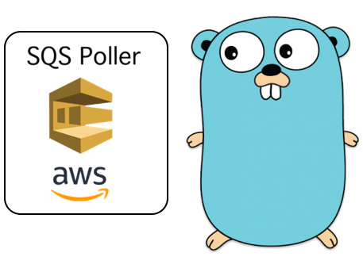

# go-sqs-poller



[](https://github.com/aint/go-sqs-poller/actions/workflows/build.yml)
[](https://goreportcard.com/report/github.com/aint/go-sqs-poller)

GoLang SQS Queue Poller using the AWS SDK v2. Released under the MIT License.

# Motivation

This package was created to provide a convenient way to poll AWS SQS. It implements a simple configurable worker which could be used through a worker pool. 

# About

This is a detached fork of [h2ik/go-sqs-poller](https://github.com/h2ik/go-sqs-poller) with the following changes:
- [x] use [AWS golang SDK V2](https://github.com/aws/aws-sdk-go)
- [x] include message user attributes [`MessageAttributeNames`]
- [x] improved logging (deleted `log.Println`, only informative debug and error logging)
- [ ] option to disable error logging of a handler function
- [ ] redesign errors
- [ ] ability to change a visibility timeout
- [ ] update project structure
- [ ] example wih a worker pool
- [ ] check compatability with logrus and zap loggers

# Quick Start:

## Installation
```shell
$ go get github.com/aint/go-sqs-poller
```

## Usage

Check out the [cmd/example-worker/main.go](cmd/example-worker/main.go) for an example of how to use the worker.
